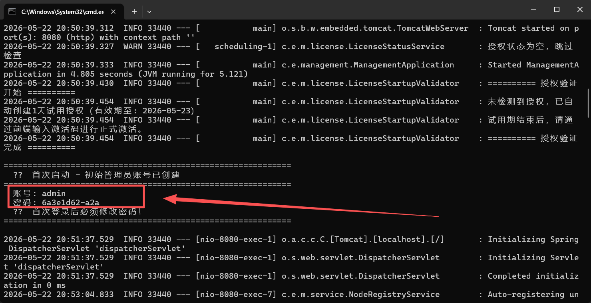

qq群600036674 

# 微服务弹性部署平台（Mini-K8s）

轻量级 Java 微服务部署平台：上传 JAR → 自动多副本 → 弹性伸缩 → 负载均衡 → 滚动更新零停机。

## 环境要求

**只需 JDK 1.8+**，无需数据库、无需中间件、无需 Node.js，跨平台开箱即用。

## 快速开始（1 个 Server + 2 个节点）

打开 3 个终端，依次运行：

```bash
# 终端 1：启动管理端
java -jar management-server-1.0.0.jar

# 终端 2：启动节点 1
java -jar agent-client-1.0.0.jar --server.port=8081

# 终端 3：启动节点 2
java -jar agent-client-1.0.0.jar --server.port=8082
```

浏览器访问 **http://localhost:8080** ，

账号 `admin` / 密码  需要在启动的控制台查看  



在"节点管理"页看到 2 个在线节点即部署完成。

> 支持部署类型：Java 应用（`.jar`） / 前端静态文件（`.zip`）

<br>

━━━━━━━━━━━━━━━━━━━━━━━━━━━━━━━━━━━━━━━━━━━━━━━━━━━━━━━━━━━━

# 📖 详细说明

> 以上为**快速开始**部分，可直接运行。以下为**详细说明**，包含界面操作、进阶部署、系统架构、技术实现。

━━━━━━━━━━━━━━━━━━━━━━━━━━━━━━━━━━━━━━━━━━━━━━━━━━━━━━━━━━━━

## 1. 界面操作指南

| 操作 | 怎么做 | 效果 |
|------|--------|------|
| 创建应用 | 总览页点「新增应用」→ 选择应用类型 → 上传文件、设副本数 | Java应用自动在多个节点启动实例 / 前端静态文件自动部署HTTP服务 |
| 扩缩容 | 应用列表点击副本数直接修改 | 自动增加或减少运行的实例数 |
| 弹性策略 | 应用列表点「弹性策略」 | 配置 CPU/内存阈值，自动扩缩容（仅Java应用） |
| 滚动更新 | 详情页上传新文件 | 逐个替换旧实例，不中断服务 |
| 下线实例 | 实例列表点「下线」 | 立即停止指定实例 |
| 查看日志 | 详情页日志区 / 实例列表点「日志」 | 支持关键字搜索、级别过滤、自动刷新 |
| 代理测试 | 详情页点「代理测试」 | 负载均衡调用实例，验证服务是否正常 |
| 节点调度 | 节点管理点「禁用/启用调度」 | 控制节点是否接收新实例 |

### 支持的部署类型

- **Java 应用**：上传 `.jar` 文件，Agent 启动 Java 进程，支持健康检查、弹性伸缩
- **前端静态文件**：上传 `.zip` 压缩包（包含 `dist/` 目录），Agent 自动解压并启动 HTTP 静态服务，支持 SPA 路由回退

---

## 2. 进阶部署

### 2.1 切换 MySQL 数据库

默认使用 **H2 文件数据库**（`./data/management.mv.db`），重启数据不丢失。如需切换 MySQL：

```bash
java -jar management-server-1.0.0.jar \
  --spring.datasource.url="jdbc:mysql://localhost:3306/management?useSSL=false&serverTimezone=UTC" \
  --spring.datasource.username=root \
  --spring.datasource.password=yourpassword \
  --spring.jpa.hibernate.ddl-auto=update
```

> H2 文件数据库已满足大多数场景，切换 MySQL 仅在需要多实例共享数据库时使用。

### 2.2 跨机器部署

Agent 在其他机器上，需要指定 Server 地址：
使用如下命令，或者修改agent的yaml文件，即可

```bash
# 在 192.168.1.100 机器上启动 Agent
java -jar agent-client-1.0.0.jar \
  --agent.host=192.168.1.100 \
  --management-server.url=http://192.168.1.1:8080
```

> 节点ID会自动使用 `192.168.1.100:8081` 格式，无需手动指定。

---

## 3. 系统架构

```
┌──────────────────────────────────────┐
│         Web 管理界面                  │
│   应用管理 / 实例管理 / 节点管理       │
│   日志查看 / 审计记录 / 弹性策略       │
└──────────────────┬───────────────────┘
                   │
                   ▼
┌──────────────────────────────────────┐
│          管理端 (Server)              │
│   自动协调 / 弹性伸缩 / 负载均衡       │
│   日志采集 / 节点管理 / 故障转移       │
└──────────┬───────────┬───────────────┘
           │           │
           ▼           ▼
    ┌──────────┐ ┌──────────┐ ┌──────────┐
    │ 节点代理  │ │ 节点代理  │ │ 节点代理  │
    │  (Agent) │ │  (Agent) │ │  (Agent) │
    │          │ │          │ │          │
    │ 运行实例  │ │ 运行实例  │ │ 运行实例  │
    └──────────┘ └──────────┘ └──────────┘
```

### 架构说明

- **Web 管理界面**：浏览器访问，所有操作通过图形界面完成
- **管理端 (Server)**：核心大脑，负责自动协调、弹性伸缩、负载均衡、日志采集
- **节点代理 (Agent)**：部署在每台机器上，负责启动/停止实例、上报心跳和日志


### 部署类型对比

| 特性 | Java 应用 | 前端静态文件 |
|------|----------|-------------|
| 文件格式 | `.jar` | `.zip`（包含 dist/ 目录） |
| 启动方式 | Java 子进程 | Java 内置 HttpServer |
| 健康检查 | 支持（可配置路径） | 根路径 `/` |
| 弹性伸缩 | 支持（CPU/内存） | 不支持 |
| 日志采集 | 支持 | 不支持 |
| SPA 路由 | - | 支持自动回退到 index.html |

---

## 4. 核心功能

### 4.1 自动协调

平台每 5 秒自动检查所有应用的期望副本数与实际运行数，自动补齐或回收实例。节点选择采用最少实例优先策略，确保负载均衡分布。端口自动分配，无需手动管理。

### 4.2 弹性伸缩（Auto Scaling）

每 15 秒检查启用弹性策略的应用，支持 CPU / 内存双指标：
- **扩容逻辑**：可配置为"任一超标"或"全部超标"才触发
- **缩容逻辑**：可配置为"全部低于"或"任一低于"才触发
- 支持最小/最大实例数、冷却时间配置，防止频繁波动

### 4.3 滚动更新（Rolling Update）

上传新版本后，平台逐个替换旧实例：每轮只启动 1 个新实例，等新实例完全就绪后才停止 1 个旧实例，实现零停机更新。

### 4.4 负载均衡

采用两层轮询策略：第一层节点级（优先跨节点分发请求），第二层实例级（同节点内轮询），确保请求均匀分布到所有健康实例。

### 4.5 多节点管理

Agent 启动后自动向管理端注册并持续重试，直到连接成功。每 5 秒心跳上报实例状态和系统指标。管理端 15 秒无心跳即标记节点离线，并自动将该节点上的实例标记为停止，触发故障转移。

### 4.6 日志采集

管理端每 10 秒从所有运行中的实例自动拉取增量日志，去重后存入数据库。支持关键字搜索、日志级别过滤、自动刷新。

### 4.7 端口冲突自适应

当请求的端口被占用时，Agent 自动往后寻找可用端口，找到后启动实例并回报实际使用的端口，无需人工干预。

### 4.8 实例生命周期管理

- **启动超时保护**：实例启动超过设定时间仍未就绪，自动停止
- **自动清理**：已停止的实例记录自动清除，保持列表整洁
- **优雅关闭**：Agent 停止时自动清理所有托管的子进程和静态服务
- **健康检查**：对运行中的实例定期执行健康探测，及时发现异常

